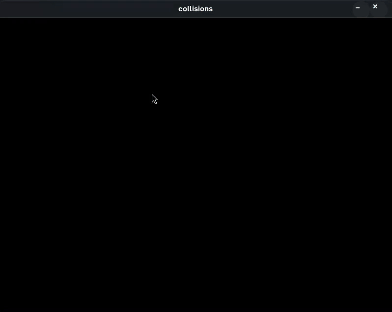
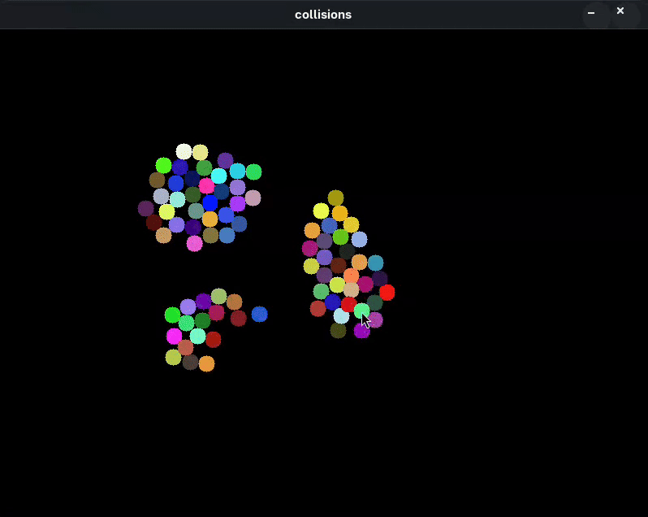

# 2D-circles-collision.
a 2D program that simulates collisions built in C with SDL2 help.

# why i made this?
i was curios how 2D games/programs are coded, so i made a 2D program with simple (simple != easy) logic implemented in it.

# how to install/use.
This project relies on SDL2/SDL lib, you need to install it first in order to use the project.

For Fedora and other Red Hat-based systems using:
`sudo dnf install SDL2-devel`

For Debian-based systems (Ubuntu, Mint...):
`sudo apt-get install libsdl2-dev`

cd into the repository and run `make` and the Makefile will compile everything, after that just run the executable `./collisions`

# features.
click anywhere inside the windows with the cursor to generate circles.

while holding "p" the circles will follow the cursor location on the window.

# learn more
[click here](https://garrulous-appeal-80f.notion.site/2D-circles-collision-2712db0d585c80939b29ced4f1cd196f?source=copy_link)
